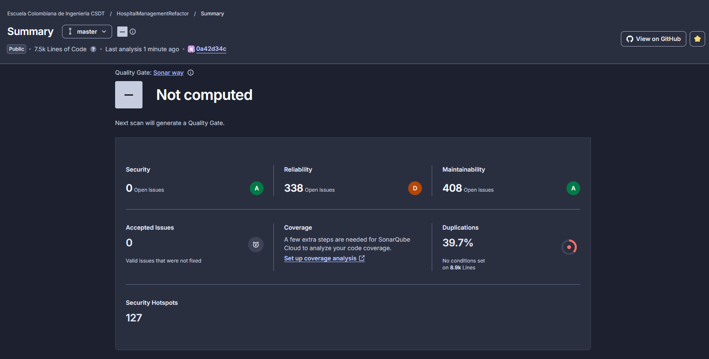
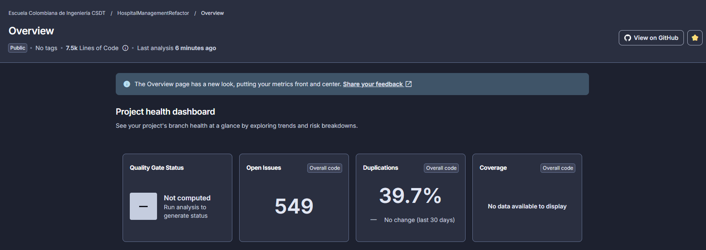
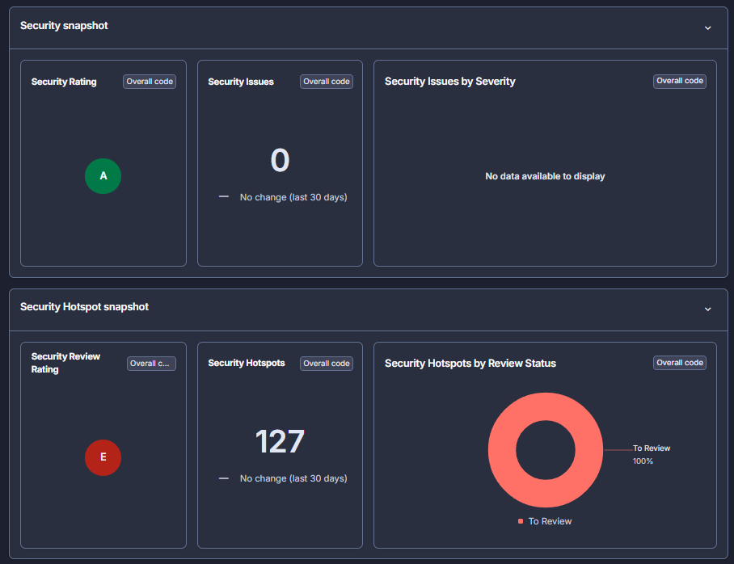
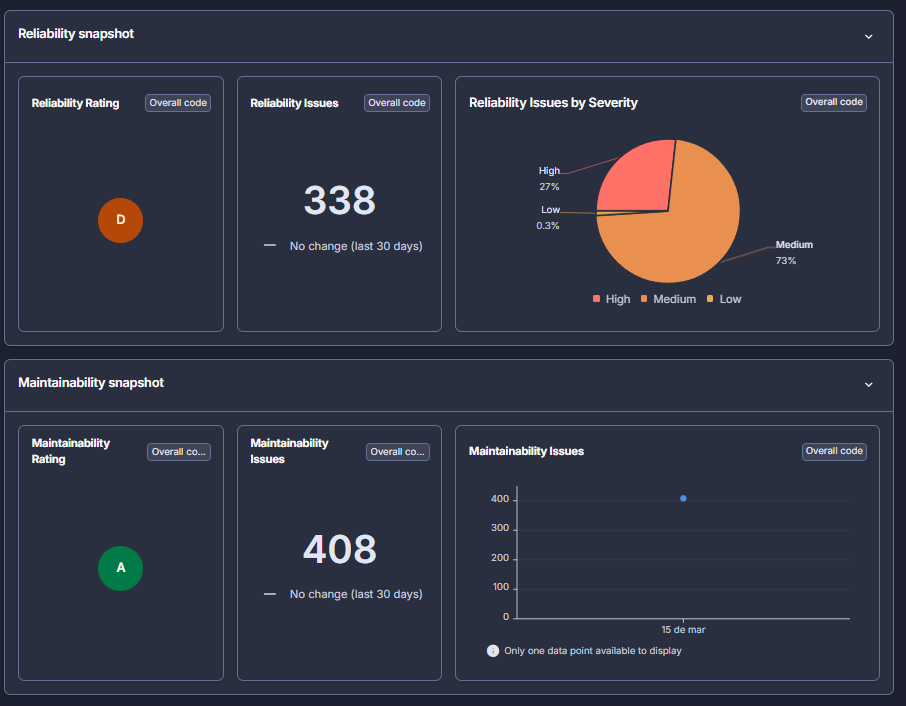
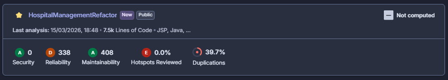
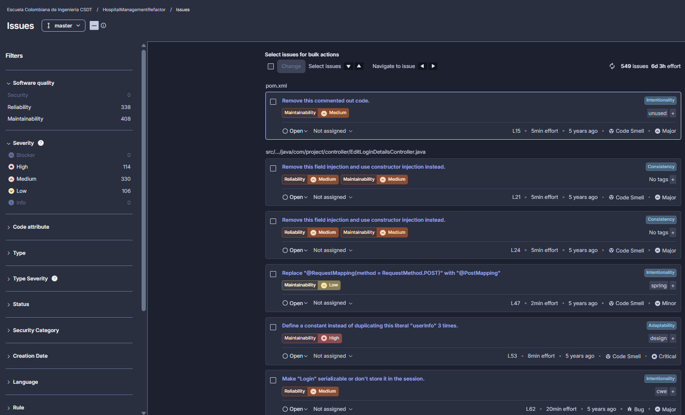

# 📊 CSDT — Primera Entrega 2026

## Modelos de Calidad: Análisis con SonarCloud

> **Proyecto:** HospitalManagementRefactor
> **Organización:** Escuela Colombiana de Ingeniería CSDT
> **Fecha de análisis:** 15 de marzo de 2026
> **Rama analizada:** `master`
> **Líneas de código:** ~7.5k (JSP, Java)

**📌 Related Analysis:** [🧪 Testing Debt & Unit Testing Implementation](./15-03-2026-TestingDebt.md) | [📋 Primera Entrega 2026](../CSDT_PrimeraEntrega2026.md)

---

## 🧰 Herramienta Utilizada: SonarCloud

### ¿Qué es SonarCloud?

[SonarCloud](https://sonarcloud.io) es la versión **100% online** de SonarQube. Realiza análisis estático de código directamente desde repositorios de GitHub sin la necesidad de instalar ningún servidor local.

### ¿Por qué elegimos SonarCloud?

| Criterio                 | Detalle                                                   |
| ------------------------ | --------------------------------------------------------- |
| 🌐 **Online**            | No requiere instalación, se conecta directamente a GitHub |
| 🆓 **Gratuito**          | Para proyectos públicos como el nuestro                   |
| ☕ **Soporte Java**      | Análisis profundo de Java, Spring MVC, JSP y Maven        |
| 📊 **Dashboard visual**  | Métricas claras exportables para documentación            |
| 🔁 **CI/CD integrado**   | Se ejecuta automáticamente en cada push                   |
| 🔍 **Modelo de calidad** | Implementa el modelo **SQALE** para deuda técnica         |

### Modelo de Calidad que implementa

SonarCloud se basa en el modelo **SQALE (Software Quality Assessment based on Lifecycle Expectations)**, que evalúa la calidad del software en cinco dimensiones:

| Dimensión | Descripción |
|---|---|
| Reliability | Comportamiento estable bajo condiciones normales y de error |
| Security | Protección contra vulnerabilidades |
| Maintainability | Facilidad para modificar el código |
| Coverage | Porcentaje de código cubierto por tests |
| Duplications | Nivel de código duplicado |

---

## 📈 Resultados del Análisis

> Primer análisis ejecutado el **15 de marzo de 2026 a las 18:48** sobre la rama `master` — 7.5k líneas de código (JSP + Java).

---

### Summary del Proyecto

> **📋 Descripción:** Vista principal del proyecto en SonarCloud luego del primer análisis. Se observa el estado general de las tres dimensiones principales: **Security (A)**, **Reliability (D)** y **Maintainability (A)**. El Quality Gate aparece como `Not computed` al ser el primer escaneo. También se destacan 127 Security Hotspots sin revisar, una duplicación del **39.7%** sobre 8.9k líneas, y cobertura sin configurar aún.

---

### Project Health Dashboard (Overview)

>
> **📋 Descripción:** Vista del _Project Health Dashboard_ con las métricas globales consolidadas: **549 issues abiertos** en total, duplicación del **39.7%** sin cambios en los últimos 30 días, cobertura sin datos disponibles y Quality Gate sin calcular. Este panel es el punto de entrada para evaluar la salud general del repositorio de un vistazo.

---

### Security Snapshot & Security Hotspots

>
> **📋 Descripción:** Panel de seguridad dividido en dos secciones. La primera muestra el **Security Rating A** con 0 vulnerabilidades activas confirmadas. La segunda muestra el **Security Hotspot Snapshot** con 127 hotspots identificados, todos en estado "To Review" (100%), lo que resulta en un **Security Review Rating E** — la peor calificación posible para esta métrica.

---

### Reliability & Maintainability Snapshot

>
> **📋 Descripción:** Snapshot de las dos dimensiones más representativas del análisis. **Reliability** obtiene Rating **D** con 338 issues distribuidos en 27% Alta y 73% Media severidad. **Maintainability** obtiene Rating **A** a pesar de tener 408 issues, con un único punto de datos disponible al 15 de marzo — primer análisis registrado.

---

### Tarjeta Resumen del Proyecto

>
> **📋 Descripción:** Tarjeta compacta del proyecto `HospitalManagementRefactor` en el listado de la organización _Escuela Colombiana de Ingeniería CSDT_. Muestra todos los ratings consolidados: Security **A**, Reliability **D**, Maintainability **A**, Hotspots Reviewed **E (0.0%)** y Duplications **39.7%**. Fecha del último análisis: 15/03/2026 a las 18:48.

---

### Vista de Issues Detallados

>
> **📋 Descripción:** Panel de Issues con filtros activos por Software Quality y Severidad. Se listan **549 issues** con esfuerzo estimado de **6 días y 3 horas**. Issues visibles: _"Remove this commented out code"_ (pom.xml L15), _"Remove this field injection and use constructor injection instead"_ (EditLoginDetailsController.java L21, L24), _"Replace @RequestMapping with @PostMapping"_ (L47), _"Define a constant instead of duplicating literal 'userInfo'"_ (L53) y _"Make Login serializable or don't store it in the session"_ (L62). Distribución: **114 High**, **330 Medium**, **106 Low**, sin Blockers.

---

## 🔗 Relación con Hallazgos Previos

Los resultados de SonarCloud **confirman y cuantifican** los problemas identificados en semanas anteriores:

| Semana               | Hallazgo Manual                      | Confirmación SonarCloud                                  |
| -------------------- | ------------------------------------ | -------------------------------------------------------- |
| Sem 1 - Code Smells  | Tight Coupling, Field Injection      | ✅ 338 Reliability issues, field injection detectado     |
| Sem 1 - Code Smells  | Magic Numbers / Literales duplicados | ✅ "Define a constant" - Critical issues                 |
| Sem 1 - Code Smells  | Poor Exception Handling              | ✅ Bugs de manejo de nulos en sesión                     |
| Sem 2 - Clean Code   | Violación DRY                        | ✅ 39.7% de duplicación confirmada                       |
| Sem 2 - Clean Code   | Anotaciones Spring desactualizadas   | ✅ Replace `@RequestMapping` con anotaciones específicas |
| Sem 3 - Testing Debt | Sin pruebas unitarias                | ✅ Coverage: sin datos disponibles                       |

---

## 🧠 Análisis con IA Complementario

Para complementar el análisis estático de SonarCloud, utilizamos **Claude (Anthropic)** como asistente de IA para:

1. **Interpretar los issues detectados** y relacionarlos con patrones de deuda técnica conocidos
2. **Proponer refactorizaciones** concretas para los issues de mayor impacto
3. **Priorizar** qué issues atacar primero según severidad y esfuerzo

**Hallazgo clave con IA:** La IA identificó que los **338 issues de Reliability** son en su mayoría consecuencia de una decisión arquitectónica original: usar **field injection** en lugar de **constructor injection** en todos los controladores y DAOs. Corregir este patrón de forma sistemática reduciría simultáneamente issues de Reliability y Maintainability, y habilitaría la escritura de pruebas unitarias (ya que el constructor injection facilita el mockeo).

---

## 💡 Conclusiones

1. **SonarCloud es una herramienta poderosa y accesible** para proyectos académicos. La integración con GitHub fue sencilla y los resultados del primer análisis fueron inmediatos y muy informativos.

2. **El mayor problema del proyecto es la Reliability (Rating D)**: 338 issues, 91 de severidad Alta, concentrados principalmente en patrones arquitectónicos como field injection y falta de serialización.

3. **La duplicación del 39.7% es alarmante** y refleja la ausencia de principios DRY en el diseño original. Refactorizar las vistas JSP con templates o fragments reduciría drásticamente este número.

4. **La ausencia de cobertura de pruebas** no solo es una deuda técnica en sí misma, sino que impide que SonarCloud calcule el Quality Gate correctamente, lo que significa que el equipo no tiene visibilidad completa del estado de calidad.

5. **Los hallazgos de SonarCloud son consistentes con el análisis manual** realizado en las semanas anteriores, lo que valida el enfoque del equipo y demuestra que el análisis estático automatizado y el análisis manual se complementan eficazmente.

6. **El Quality Gate "Not computed"** cambiará en el próximo análisis. Se recomienda que el equipo configure un Quality Gate personalizado que incluya umbrales de coverage y duplicación para futuras entregas.

---

## 🔗 Recursos

- 🔗 [SonarCloud — Proyecto HospitalManagementRefactor](https://sonarcloud.io)
- 🔗 [Repositorio GitHub](https://github.com/Escuela-Colombiana-de-Ingenieria-CSDT/HospitalManagementRefactor)
- 📖 [Documentación SonarCloud](https://docs.sonarcloud.io)
- 📖 [Modelo SQALE](https://www.sonarsource.com/docs/CognitiveComplexity.pdf)
- 📖 [CWE — Common Weakness Enumeration](https://cwe.mitre.org)
- 📖 [Top 40 Static Code Analysis Tools](https://www.softwaretestinghelp.com/tools/top-40-static-code-analysis-tools/)

---

## 🔗 Relacionados

- **Anterior:** [🧪 Testing Debt & Unit Testing Implementation](./15-03-2026-TestingDebt.md)
- **Resumen:** [📋 Primera Entrega 2026](../CSDT_PrimeraEntrega2026.md)
- **Inicio:** [📚 README Principal](../README.md)

---

_[⬆ Back to top](#-csdt--primera-entrega-2026)_

**CSDT_M — Software Quality and Technical Debt | Escuela Colombiana de Ingeniería | 2026**

