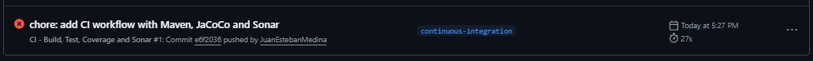
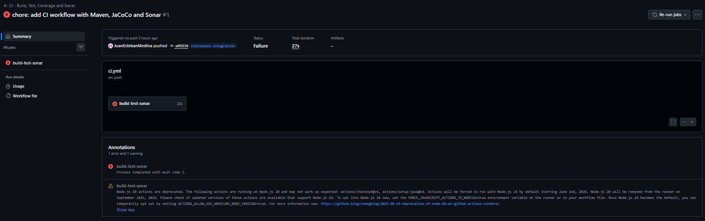
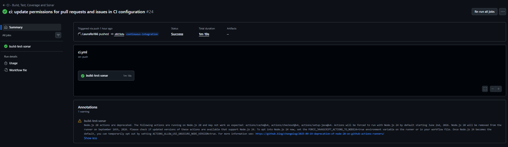

# CI/CD Pipeline Implementation - 29/03/2026

## 📋 Table of Contents

1. [CI/CD Pipeline Creation](#1-cicd-pipeline-creation)
2. [Additional Step: PR Comment Bot](#2-additional-step-pr-comment-bot)

---

## 1. CI/CD Pipeline Creation

### Overview

A Continuous Integration pipeline was configured using **GitHub Actions**. The workflow file `.github/workflows/ci.yml` was added and triggers on:

- **Push** to the `continuous-integration` branch
- **Pull Requests** targeting the `master` branch

The `SONAR_TOKEN` secret was configured in the repository settings prior to the first execution.

---

### Pipeline Steps

The pipeline runs a single job `build-test-sonar` on `ubuntu-latest`:

| Step                                  | Tool                           | Description                                                                             |
| ------------------------------------- | ------------------------------ | --------------------------------------------------------------------------------------- |
| **Checkout repository**               | `actions/checkout@v4`          | Clones the repo with full history (`fetch-depth: 0`) for accurate SonarCloud blame data |
| **Set up JDK 11**                     | `actions/setup-java@v4`        | Configures Java 11 (Temurin) with Maven cache                                           |
| **Build and run tests with coverage** | Maven                          | Runs `mvn -B -Pcoverage clean verify` to compile, test, and generate JaCoCo coverage    |
| **Analyze with SonarCloud**           | `sonarqube-scan-action@v5.0.0` | Sends analysis to SonarCloud                                                            |
| **Bot — Comment on PR**               | `actions/github-script@v7`     | Posts automated CI report on PRs                                                        |

---

### First Execution & Build Failure

Upon the first push to `continuous-integration`, the pipeline triggered automatically and **failed at the Build step** (total duration: 27s).





#### Root Cause

The Maven build produced **49 compilation errors** across 13 controller classes. The project uses `HttpServletRequest` and `HttpSession` from `javax.servlet.http`, but this dependency is not declared in `pom.xml`, making it unavailable in a clean CI environment.

```
[ERROR] COMPILATION ERROR :
package javax.servlet.http does not exist
cannot find symbol: class HttpServletRequest
cannot find symbol: class HttpSession
...
[INFO] 49 errors
[INFO] BUILD FAILURE
[INFO] Total time: 12.292 s
```

Affected controllers span all major modules:

| Module          | Affected Files                                                                                                                                   |
| --------------- | ------------------------------------------------------------------------------------------------------------------------------------------------ |
| `doctor`        | `DopdDetailsController`, `patientObservePrescribeController`, `PatientHistoryController`, `PatientDopdDetailsController`, `DeleteDopdController` |
| `administrator` | `SearchEmployeeController`, `ShowAllEmployeeDetailsController`, `EditEmployeeController`                                                         |
| `receptionist`  | `PatientPrescriptionController`                                                                                                                  |
| `root`          | `PersonalInfoController`, `LoginController`, `LogOutController`, `EditLoginDetailsController`                                                    |

#### Pipeline Impact

| Step              | Status     | Reason                         |
| ----------------- | ---------- | ------------------------------ |
| 🔨 Build          | ❌ Failed  | 49 compilation errors          |
| 🧪 Unit Tests     | ⏭️ Skipped | Build did not complete         |
| 🔍 Sonar Analysis | ⏭️ Skipped | No compiled classes to analyze |
| 🤖 PR Bot         | ⏭️ Skipped | Job did not reach this step    |

**No SonarCloud report was generated**, as the project could not compile in a clean environment. This failure itself is evidence of the technical debt present: the project had never been validated outside of a local IDE that implicitly provided servlet dependencies.

---

### Pipeline Stabilization

Subsequent commits on `continuous-integration` resolved the CI configuration issues (SonarCloud keys, permissions, action versions). The pipeline reached a ✅ passing state, confirming the infrastructure is correctly set up. The compilation issue in the application source code remains open and will be addressed in upcoming sprints as part of the technical debt remediation effort.



---

## 2. Additional Step: PR Comment Bot

### Overview

A new step was implemented in the CI/CD pipeline that automates the publication of status reports in Pull Requests through a GitHub bot.

### Functionality

The `🤖 Bot - Comment PR Result` step performs the following operations:

#### a) Comment Management

- Retrieves the list of existing comments in the PR
- Searches for and deletes previous bot comments containing "🤖 CI Report"
- Prevents accumulation of duplicate comments
- Ensures only the latest CI report is visible

#### b) Report Generation

The bot creates a markdown-formatted comment that includes:

- **Status Table**: Displays the result (✅/❌) of:
  - 🔨 Build
  - 🧪 Unit Tests
  - 🔍 Sonar Analysis (with direct link to analysis)

#### c) Enhanced Change Summary

The bot automatically extracts and displays:

- **Commit Information**:
  - List of commits with message preview (up to 5 most recent)
  - Abbreviated commit hash for quick reference
- **File Changes**:
  - All modified files with change type (added, modified, removed, etc.)
  - File paths for easy navigation
  - Total count of changed files
- **Context Information**:
  - Full commit SHA
  - Source branch → target branch flow
  - User who triggered the pipeline

#### d) Conditional Execution

- Only executes when the event is `pull_request`
- Uses `actions/github-script@v7` to interact with GitHub API
- Requires read/write permissions on issues and pull requests

### Benefits of Enhanced Comments

- ✅ **Transparency**: Complete visibility into what changed without leaving the PR
- ✅ **Audit Trail**: All commits and file changes preserved in PR history
- ✅ **Reduced Context Switching**: No need to check out branch or review history separately
- ✅ **Quick Assessment**: Reviewers immediately see scope and nature of changes
- ✅ **CI Status Integration**: All CI results in one convenient comment

### Required Configuration

For proper operation, the following secrets must be configured in the repository:

- `GITHUB_TOKEN`: Authentication token (included by default in GitHub Actions)
- `SONAR_TOKEN`: Token for SonarCloud authentication (generate from SonarCloud account settings)

### SonarCloud Project Configuration

The project `csdt-eci_HospitalManagementRefactor` must be created and linked in SonarCloud:

1. Project exists at: https://sonarcloud.io/organizations/csdt-eci
2. GitHub repository is linked for automatic PR analysis
3. Main branch: `master`

### GitHub Secrets Setup

Add the following secret to your GitHub repository (Settings → Secrets and variables → Actions):

- **Name**: `SONAR_TOKEN`
- **Value**: Your SonarCloud authentication token

### Benefits

- ✅ Immediate feedback to developers in the PR
- ✅ Prevents noise from accumulated comments
- ✅ Direct access to code analysis reports
- ✅ Centralized pipeline status information in PR context

### Technical Implementation

```yaml
- name: Analyze with SonarCloud
  uses: SonarSource/sonarqube-scan-action@v5.0.0
  env:
    GITHUB_TOKEN: ${{ secrets.GITHUB_TOKEN }}
    SONAR_TOKEN: ${{ secrets.SONAR_TOKEN }}
    SONAR_HOST_URL: https://sonarcloud.io
  with:
    args: >
      -Dsonar.projectKey=csdt-eci_HospitalManagementRefactor
      -Dsonar.organization=csdt-eci
      ${{ github.event_name == 'pull_request' &&
        format('-Dsonar.pullrequest.key={0} -Dsonar.pullrequest.branch={1} -Dsonar.pullrequest.base={2}',
          github.event.pull_request.number,
          github.head_ref,
          github.base_ref)
        || format('-Dsonar.branch.name={0}', github.ref_name) }}
```

### Root Cause Analysis & Resolution

**Problem**: SonarCloud failed with "Could not find a default branch" error during PR analysis.

**Root Cause**: When analyzing a pull request, `github.ref_name` returns an internal PR reference (e.g., `8/merge`) instead of the actual branch name. SonarCloud couldn't map this to any known branch.

**Solution**: Implement conditional parameter passing:

- **For Pull Requests**: Use `sonar.pullrequest.*` properties with correct metadata
  - `pullrequest.key`: PR number
  - `pullrequest.branch`: Source branch (via `github.head_ref`)
  - `pullrequest.base`: Target branch (via `github.base_ref`)
- **For Push Events**: Use `sonar.branch.name` with actual branch reference

This ensures SonarCloud correctly identifies the context and associates the analysis with the proper branch configuration.

### Troubleshooting (Resolved)

✅ **"Could not find a default branch" error** - Fixed by using correct PR parameters

---

**Implementation Date**: March 29, 2026
**Status**: ✅ Completed
**Last Updated**: March 30, 2026 - Fixed PR analysis with proper pullrequest parameters
